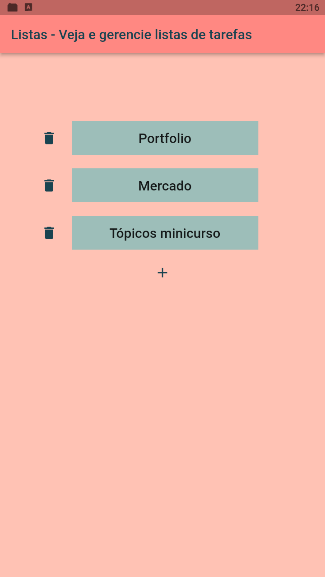
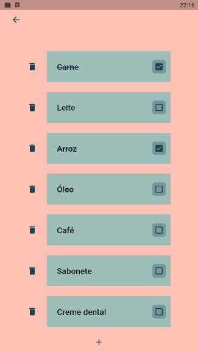

# LISTA-TODO (Gerenciador de listas de tarefas)

## Índice

- <a href="#funcionalidades" >Funcionalidades</a>
- <a href="layout">Layout</a>
- <a href="#tecnologias-utilizadas" >Tecnologias utilizadas</a>
- <a href="como-executar">Como executar</a>
- <a href="autores">Autores</a>

## Funcionalidades

- [x] Criar múltiplas listas de tarefas
- [x] Alternar entre listas
- [x] Adicionar/remover tarefas em uma lista
- [x] Mudar estado de uma tarefa (concluída/pendente)
- [x] Excluir lista de tarefas

## Layout




## Tecnologias utilizadas

- [Visual Studio Code](https://code.visualstudio.com/)
- [Flutter](https://docs.flutter.dev/)
- [Dart](https://dart.dev/guides)
- [Isar Database](https://isar.dev/)

## Como executar

```
# Clone este repositório
$ git clone https://github.com/bruno743/flutter-custom-lista-todo.git

# Acesse a pasta do projeto
$ cd flutter-custom-lista-todo

# Instale as dependências
$ flutter pub get

# Execute a aplicação
```
Para iniciar a aplicação no VS Code é preciso selecionar o dispositivo em que será executada e iniciar a depuração. Mais detalhes na documentação do Flutter, na seção [Test drive](https://docs.flutter.dev/get-started/test-drive).

## Autores

imagem

[Linkedin](https://www.linkedin.com/in/bruno-felipe-608a85219/)
